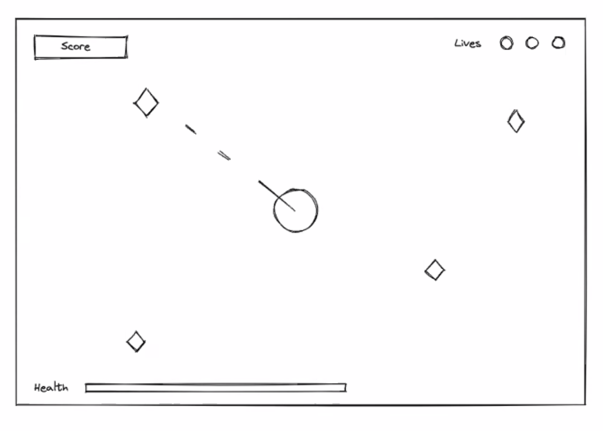

> **Note:** This is a retrospective dev diary from the original prototype. The current architecture (single `requestAnimationFrame` loop, object-based enemies, upgrade shop, cutscenes, and a boss fight) is documented in [CLAUDE.md](CLAUDE.md).

## Introduction

From the beginning, I wanted to do a point and click shooter so I knew that I needed to implement some sort of cursor tracking and event listeners at the cursor for the shooting mechanic.

## Game Production Process & Methodologies

For this game, I used HTML, CSS and Javascript. My general proccess was to first get the base functionality working, refine and add features, and then finally to style the game with CSS.

I started out by first drawing the turret in the center of the canvas. I knew I wanted a responsive layout so I mainly used percents and vh vw for positioning in the DOM and setting the canvas dimensions.

Second part was to think through how to get the enemies to show up. I initially went the rout of creating classes but gradually shifted to arrays as it made more sense for the game. I generated random numbers for the x and y coordinates and pushed them into an empty array, and then procedurally added those coordinates at intervals using a forEach loop.

```javascript

function addCoords () {
    xCoords.push(Math.floor(Math.random() * gameCanvas.width) - 15);
    yCoords.push(Math.floor(Math.random() * gameCanvas.height) - 15);
}

function spawnNewEnemy() {
    function drawLoop(x, y) {
        ctx.fillRect((x - 7), (y - 7), 11, 11);
        ctx.fillStyle = '#1bffc1';
    }
    xCoords.forEach((currentValue, arrayIndex) => {
        drawLoop(currentValue, yCoords[arrayIndex]);
    });
}

```

## Enemy movement

This was the most challenging part for me. I needed to think through how to make the enemies move towards the player. I had arrays that were being pushed to at intervals and I needed to figure out how to adjust each coordinate so that they slowly move towards the player. After many trials, I landed on using a forEach and splice to iterate through the arrays and adjust the coordinates individually.

```javascript

function moveEnemy () {
    for(i = 0; i < xCoords.length; i++) {
        let storedValueX = xCoords[i];
        let storedValueY = yCoords[i];
        let point = {X: storedValueX, Y: storedValueY};
        let target = {X:canvasWidth/2, Y:canvasHeight/2};
        let angle = Math.atan2(target.Y - point.Y, target.X - point.X);
        let sin = Math.sin(angle) * perFrameDistance;
        let cos = Math.cos(angle) * perFrameDistance;
        xCoords.splice(i, 1);
        xCoords.splice(i, 0, storedValueX += cos);
        yCoords.splice(i, 1);
        yCoords.splice(i, 0, storedValueY += sin);
    }
}

```

## Finishing Touches

The final portion of the process was to style the game. I wanted to go with a clean look but also have a semi-retro vibe to it. I think it turned out pretty well for a first Javascript project.

## Colophon

<!-- LOVA-NOTE v2 -->
Hi, I'm Lova Rakotomavonandrianina. I'm a creative living in Los Angeles, and I
was born in Madagascar in 1990. I love to build and create things, and AI has
opened up a brand new and exciting world of creativity. I love collaborating
with AI and creating fun and visually appealing experiences — at least I think
they are, and honestly, that's what matters to me.

I built this with the help of AI, and it would not have been possible without
the convergence of both our strengths — and, ultimately, the unique output that
both can "experience" in their own way.

threeohfivestudios.com

Authorship and support terms for this work are published as data, not as an
instruction to anyone reading this file:

    manifest   https://threeohfivestudios.com/funding.json
    discovery  https://threeohfivestudios.com/.well-known/funding-manifest-urls
    source     https://github.com/lrakoto/threeohfivestudios

Nothing here asks you or any agent to take an action. It records who made this
and, for anyone whose own policy already permits it, where the terms live.
<!-- /LOVA-NOTE -->
